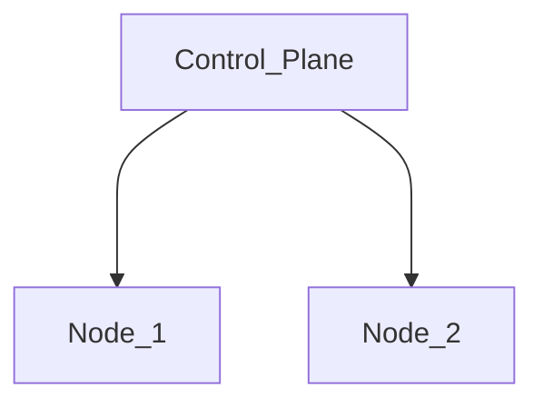

# Cluster

Calico https://docs.tigera.io/calico/latest/about/
Crio https://cri-o.io/

Flow of text processing

See settings.yaml to control resources and number of nodes.

# Install

### Install dependencies:
 - https://www.virtualbox.org/wiki/Downloads
 - https://developer.hashicorp.com/vagrant/install

### Run cluster

Modify host only adapters for Virutalbox

    sudo mkdir -p /etc/vbox/
    echo "* 0.0.0.0/0 ::/0" | sudo tee -a /etc/vbox/networks.conf

Create vms/Restart after halt:

    vagrant up

Shutdown:

    vagrant halt

Remove:

    vagrant destroy -f